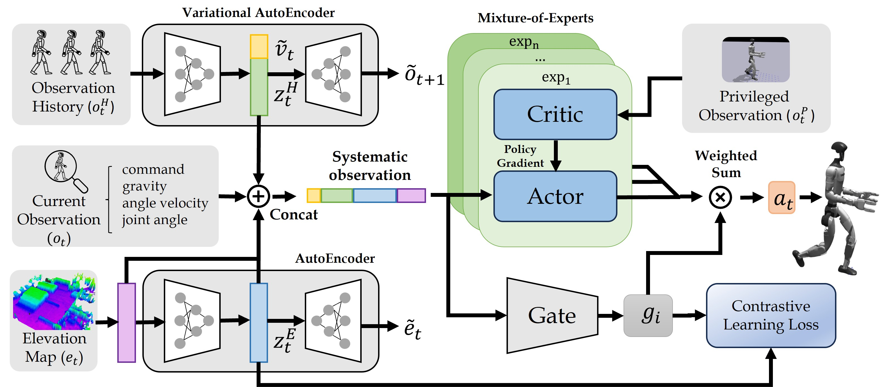

# CMoE: Contrastive Mixture of Experts for Motion Control and Terrain Adaptation of Humanoid Robots

[](https://hoshi-no-ai.github.io/CMoE/)
[](https://arxiv.org/abs/2603.03067)
[](https://hoshi-no-ai.github.io/CMoE/)
[](https://youtu.be/Q95Ssg1FP7A)
[](LICENSE)

Official implementation of **CMoE: Contrastive Mixture of Experts for Motion Control and Terrain Adaptation of Humanoid Robots**, accepted to **ICRA 2026**.

Shihao Ma<sup>&#42;</sup>, Hongjin Chen<sup>&#42;</sup>, Zijun Xu<sup>&#42;</sup>, Yi Zhao, Ke Wu, Ruichen Yang, Leyao Zou, Zhongxue Gan<sup>†</sup>, Wenchao Ding<sup>†</sup>

Fudan University &nbsp;&nbsp;(<sup>&#42;</sup> Equal Contribution, <sup>†</sup> Corresponding Authors)

[Project Page](https://hoshi-no-ai.github.io/CMoE/) &nbsp;|&nbsp; [Paper](https://arxiv.org/abs/2603.03067) &nbsp;|&nbsp; [arXiv](https://arxiv.org/abs/2603.03067) &nbsp;|&nbsp; [Video](https://youtu.be/Q95Ssg1FP7A)

<p align="center">
  
</p>

## Abstract

For effective deployment in real-world environments, humanoid robots must autonomously navigate a diverse range of complex terrains with abrupt transitions. While the Vanilla mixture of experts (MoE) framework is theoretically capable of modeling diverse terrain features, in practice, the gating network exhibits nearly uniform expert activations across different terrains, weakening the expert specialization and limiting the model's expressive power. To address this limitation, we introduce CMoE, a novel single-stage reinforcement learning framework that integrates contrastive learning to refine expert activation distributions. By imposing contrastive constraints, CMoE maximizes the consistency of expert activations within the same terrain while minimizing their similarity across different terrains, thereby encouraging experts to specialize in distinct terrain types. We validated our approach on the Unitree G1 humanoid robot through a series of challenging experiments. Results demonstrate that CMoE enables the robot to traverse continuous steps up to 20 cm high and gaps up to 80 cm wide, while achieving robust and natural gait across diverse mixed terrains, surpassing the limits of existing methods. To support further research and foster community development, we will release our code publicly.

## Overview

CMoE is a single-stage, end-to-end reinforcement learning framework for humanoid locomotion that directly maps multimodal sensory inputs to robot actions. Its key components are:

- **Mixture-of-Experts actor-critic model.** A set of specialized experts whose outputs are combined by a **gating network**, enabling the policy to adopt distinct terrain-response strategies across complex, heterogeneous surfaces.
- **Contrastive learning objective.** A contrastive loss built on learnable **prototypes** that maximizes the consistency of expert activations within the same terrain while minimizing their similarity across different terrains, driving genuine **expert specialization** instead of the near-uniform activation of the vanilla MoE.
- **Estimators.** Two estimators feed the gating network and the experts: a **state estimator** that processes proprioceptive history and a **terrain estimator** that processes the terrain height map.

The framework is trained in simulation with [Isaac Gym](https://developer.nvidia.com/isaac-gym) and validated on the **Unitree G1** humanoid robot.

## Framework

<p align="center">
  
</p>

## Code Structure

```
CMoE/
├── legged_gym/        # Isaac Gym environments (humanoid, terrains, training/play scripts)
│   └── legged_gym/
│       ├── envs/      # Humanoid env + G1 CMoE config (task "g1cmoe")
│       ├── scripts/   # train.py, play.py
│       └── utils/     # terrain, helpers, logger, task registry
└── rsl_rl/            # RL algorithms
    └── rsl_rl/
        ├── modules/   # cmoe_actor_critic, expert_actor_critic, state_estimator, terrain_estimator
        ├── algorithms/# cmoe_ppo (PPO + estimator updates + contrastive loss)
        └── runners/   # cmoe_on_policy_runner
```

## Installation

We test our code under the following environment:

- Ubuntu 20.04
- NVIDIA GPU (tested on RTX 4090, driver 550)
- Python 3.8
- PyTorch 1.13.1 (CUDA 11.7 build)
- Isaac Gym Preview 4

1. Create a conda environment and install PyTorch:

   ```bash
   conda create -n cmoe python=3.8
   conda activate cmoe
   pip3 install torch==1.13.1+cu117 torchvision==0.14.1+cu117 torchaudio==0.13.1+cu117 \
       --extra-index-url https://download.pytorch.org/whl/cu117
   ```

2. Install Isaac Gym Preview 4 (download from https://developer.nvidia.com/isaac-gym):

   ```bash
   cd isaacgym/python && pip install -e .
   ```

3. Clone this repository and install the provided `rsl_rl` and `legged_gym` packages:

   ```bash
   git clone https://github.com/Fudan-MAGIC-Lab/CMoE.git
   cd CMoE
   cd rsl_rl && pip install -e . && cd ..
   cd legged_gym && pip install -e . && cd ..
   ```

   **Note:** Please use the `legged_gym` and `rsl_rl` provided in this repository. They contain CMoE-specific modifications and are not interchangeable with the upstream versions.

## Usage

### Training

Train the CMoE policy on the Unitree G1:

```bash
python legged_gym/legged_gym/scripts/train.py --task=g1cmoe --alg=cmoe --run_name <name>
```

- `--task=g1cmoe` selects the Unitree G1 humanoid environment with the CMoE configuration.
- `--alg=cmoe` selects the CMoE training pipeline (MoE actor-critic with the contrastive objective and the two estimators).
- `--run_name <name>` names the run; logs and checkpoints are written under `legged_gym/logs/`.

Monitor training with TensorBoard:

```bash
tensorboard --logdir legged_gym/logs
```

### Play

Visualize and export the latest trained policy:

```bash
python legged_gym/legged_gym/scripts/play.py --task=g1cmoe --alg=cmoe
```

## Roadmap

This initial release focuses on the simulation training code. Deployment (MuJoCo and real-robot) and pre-trained checkpoints are planned for a future release — see [TODO.md](TODO.md).

## Citation

If you find our work useful, please consider citing our paper:

```bibtex
@inproceedings{ma2026cmoe,
  title={CMoE: Contrastive Mixture of Experts for Motion Control and Terrain Adaptation of Humanoid Robots},
  author={Shihao Ma and Hongjin Chen and Zijun Xu and Yi Zhao and Ke Wu and Ruichen Yang and Leyao Zou and Zhongxue Gan and Wenchao Ding},
  booktitle={2026 IEEE International Conference on Robotics and Automation (ICRA)},
  year={2026},
  organization={IEEE},
  url={https://arxiv.org/abs/2603.03067}
}
```

## License

This project is released under the BSD-3-Clause License (see [LICENSE](LICENSE)). The bundled `legged_gym/` and `rsl_rl/` directories are derived from upstream projects and retain their original BSD-3-Clause licenses; see their respective `LICENSE` files and the root [NOTICE](NOTICE).

## Acknowledgements

CMoE is built upon several excellent open-source projects:

- [legged_gym](https://github.com/leggedrobotics/legged_gym) (ETH Zurich, Robotic Systems Lab) — Isaac Gym environments for legged robots.
- [rsl_rl](https://github.com/leggedrobotics/rsl_rl) (ETH Zurich, Robotic Systems Lab) — fast and simple GPU-based RL algorithms.
- [HIMLoco](https://github.com/OpenRobotLab/HIMLoco) — the Hybrid Internal Model project this codebase was originally forked from.

We thank the authors for making their work publicly available.
